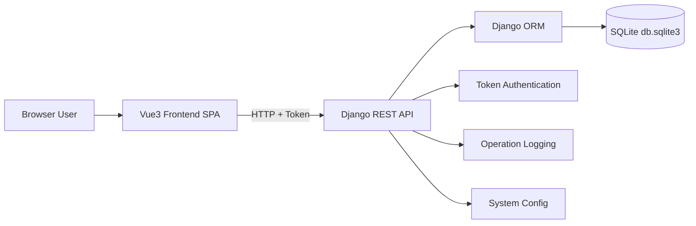
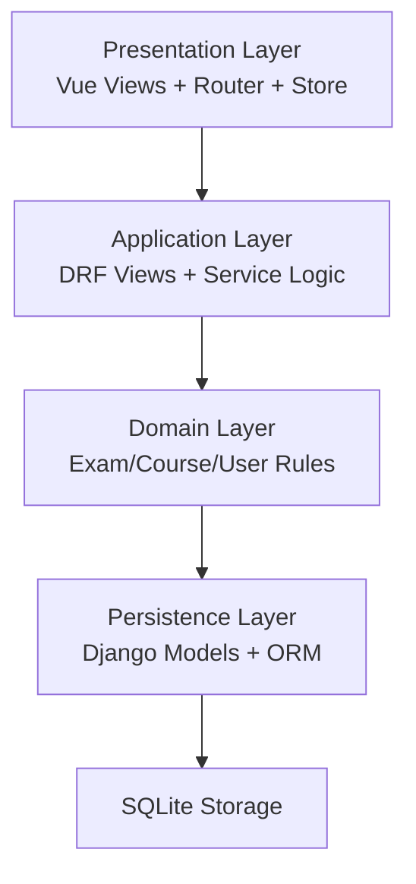
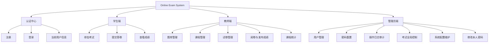
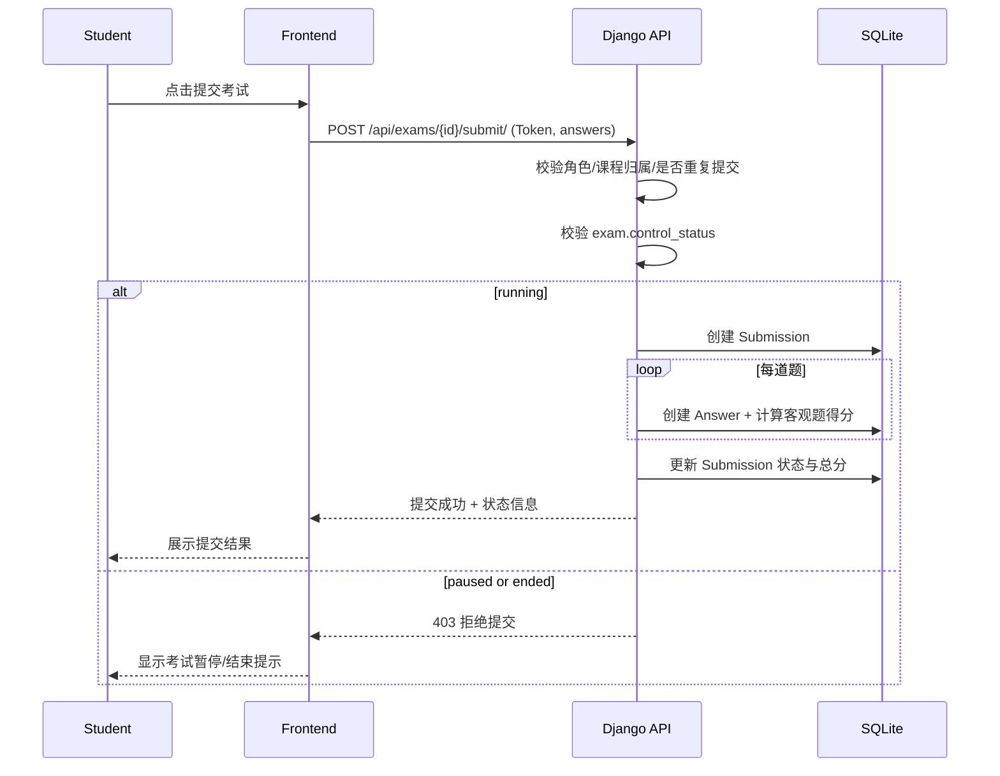
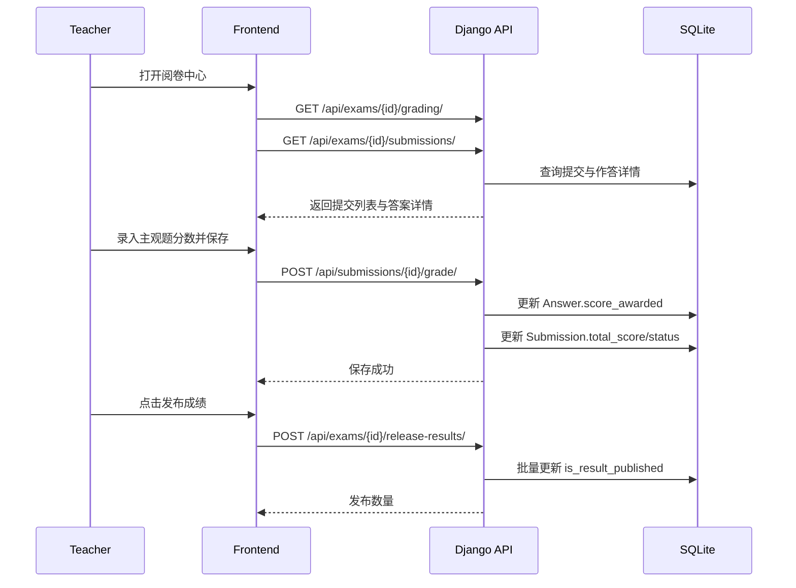
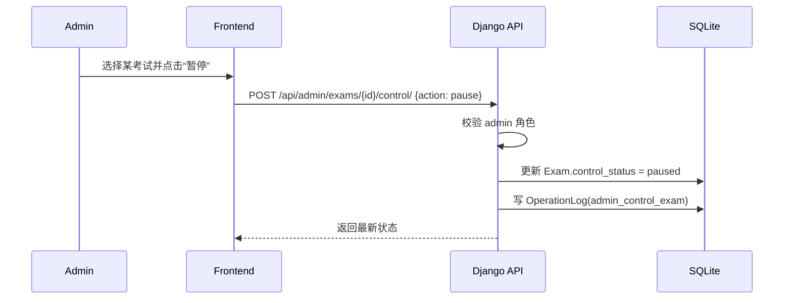
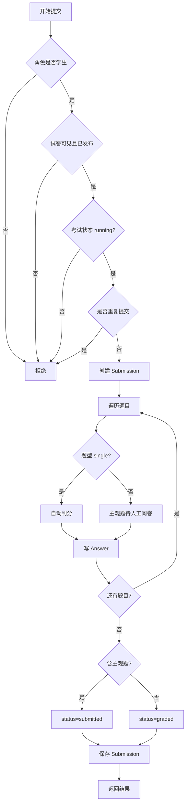
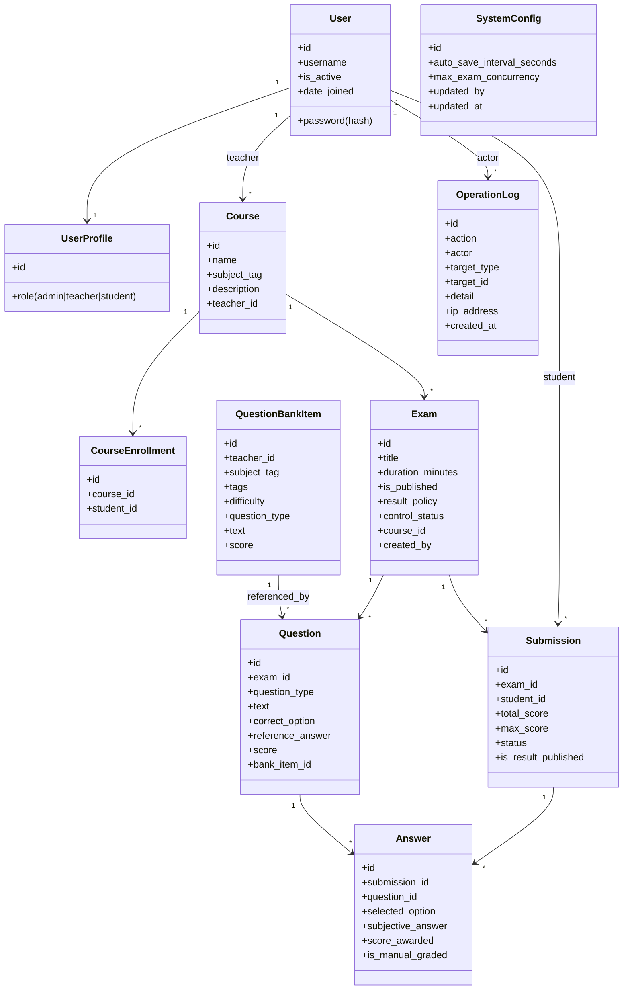
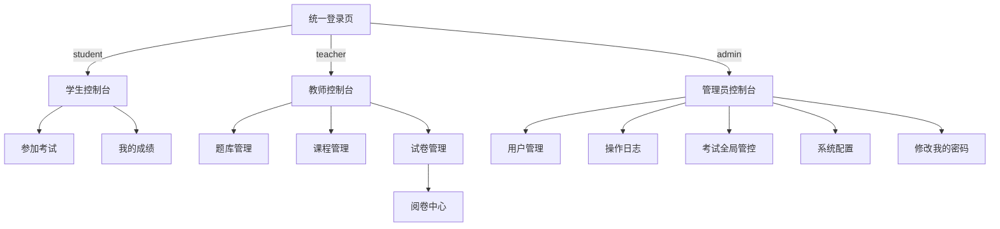

# Online Exam System 系统设计说明书

## 1. 文档概述

### 1.1 文档目的
本说明书用于描述在线考试系统的系统设计方案，覆盖架构、功能结构、关键业务时序、算法、面向对象类设计、接口、数据库物理设计及 UI 设计，为开发、测试、运维和后续扩展提供统一依据。

### 1.2 适用范围
- 后端：Django + DRF + SQLite
- 前端：Vue 3 + Vite
- 角色：管理员、教师、学生

### 1.3 术语
- Exam：试卷
- Submission：交卷记录
- Answer：题目作答记录
- QuestionBank：题库
- RBAC：基于角色的访问控制

---

## 2. 系统体系架构

### 2.1 总体架构
系统采用前后端分离架构，前端 SPA 通过 HTTP/JSON 访问后端 REST API。



### 2.2 分层架构


### 2.3 架构特性
- 前后端职责清晰：前端负责交互与状态，后端负责权限和业务规则。
- 安全边界明确：TokenAuthentication + 角色校验。
- 审计可追溯：关键操作写入 OperationLog。
- 管控可扩展：系统配置和考试全局状态独立建模。

---

## 3. 系统功能结构（层次结构）

### 3.1 角色与模块


### 3.2 功能分解说明
- 认证中心：统一登录入口，按角色自动分流到对应控制台。
- 学生端：查看可见试卷、作答提交、查看已发布成绩。
- 教师端：维护课程/题库、组卷发布、主观题阅卷、统一发布成绩。
- 管理员端：用户生命周期管理、审计日志、考试状态全局管控、系统参数维护。

---

## 4. 系统用例时序图（顺序图）与说明

### 4.1 用例 A：学生提交试卷



说明：
- 该流程体现了“考试全局状态管控”对提交行为的约束。
- 若含主观题，提交后状态为 submitted，需教师阅卷后再发布成绩。

### 4.2 用例 B：教师阅卷并发布成绩



说明：
- 阅卷和发布分离，避免“未审核主观题即出分”。
- 提交详情包含学生答案与标准答案，支持人工判卷。

### 4.3 用例 C：管理员全局暂停考试



说明：
- 暂停后学生提交接口立即受影响。
- 日志留痕满足审计要求。

---

## 5. 复杂功能算法设计

### 5.1 算法 1：交卷判分与状态流转

#### 5.1.1 流程图


#### 5.1.2 伪码
```text
function submit_exam(student, exam, answers):
    assert role(student) == 'student'
    assert exam.is_published
    assert exam.control_status == 'running'
    assert not exists_submission(exam, student)

    submission = create_submission(exam, student)
    total = 0
    max_score = 0
    has_subjective = false

    for q in exam.questions:
        max_score += q.score
        ans = answers.get(q.id)
        if q.type == 'single':
            awarded = q.score if ans == q.correct_option else 0
            create_answer(submission, q, selected_option=ans, score=awarded)
        else:
            has_subjective = true
            create_answer(submission, q, subjective_answer=ans, score=0)
        total += awarded

    submission.total_score = total
    submission.max_score = max_score
    submission.status = 'submitted' if has_subjective else 'graded'
    save(submission)
    return submission
```

### 5.2 算法 2：管理员考试状态全局控制

#### 5.2.1 伪码
```text
function admin_control_exam(admin, exam, action):
    assert role(admin) == 'admin'
    map = {pause: paused, resume: running, end: ended}
    assert action in map
    exam.control_status = map[action]
    save(exam)
    write_log(action='admin_control_exam', actor=admin, target=exam)
    return exam.control_status
```

### 5.3 算法 3：管理员密码修改（本人）

#### 5.3.1 伪码
```text
function admin_change_own_password(admin, old_pwd, new_pwd):
    assert role(admin) == 'admin'
    assert verify_password(admin, old_pwd)
    assert len(new_pwd) >= 6 and new_pwd != old_pwd
    set_password(admin, new_pwd)
    rotate_token(admin)
    write_log(action='admin_change_own_password', actor=admin)
    return new_token
```

---

## 6. 面向对象方法类图详细设计

### 6.1 核心类图


### 6.2 设计说明
- User 与 UserProfile 一对一分离，避免污染内置 User 模型。
- Submission 与 Exam+Student 有唯一约束，保证“一人一卷一次提交”。
- OperationLog 与 SystemConfig 为管理能力抽象，降低业务耦合。

---

## 7. 接口设计

### 7.1 设计原则
- 风格：RESTful + JSON
- 鉴权：`Authorization: Token <token>`
- 错误返回：`{ "error": "message" }`
- 权限校验：在视图函数中按角色硬校验

### 7.2 核心接口清单

| 模块 | 方法 | 路径 | 角色 | 说明 |
|---|---|---|---|---|
| 认证 | POST | /api/auth/register/ | 游客 | 注册（admin 首个账号初始化后禁用公开注册） |
| 认证 | POST | /api/auth/login/ | 游客 | 登录并返回 token |
| 认证 | GET | /api/auth/me/ | 全角色 | 当前用户信息 |
| 课程 | GET/POST | /api/courses/ | 教师/学生 | 创建或查询课程 |
| 课程 | GET/POST | /api/courses/{id}/students/ | 教师 | 添加/移除学生 |
| 课程 | GET | /api/courses/{id}/stats/ | 教师 | 课程统计 |
| 题库 | GET/POST | /api/question-bank/ | 教师 | 题库查询/创建 |
| 题库 | PUT/DELETE | /api/question-bank/{id}/ | 教师 | 题库编辑/删除 |
| 考试 | GET/POST | /api/exams/ | 管理员/教师/学生 | 试卷列表/创建 |
| 考试 | GET | /api/exams/{id}/ | 教师/学生 | 试卷详情 |
| 考试 | POST | /api/exams/{id}/submit/ | 学生 | 提交答卷 |
| 阅卷 | GET | /api/exams/{id}/grading/ | 教师 | 阅卷总览 |
| 阅卷 | GET | /api/exams/{id}/submissions/ | 教师 | 提交详情 |
| 阅卷 | POST | /api/submissions/{id}/grade/ | 教师 | 主观题评分 |
| 阅卷 | POST | /api/exams/{id}/release-results/ | 教师 | 发布成绩 |
| 学生成绩 | GET | /api/submissions/mine/ | 学生 | 我的提交与成绩 |
| 管理员用户 | GET/POST | /api/admin/users/ | 管理员 | 用户查询与创建 |
| 管理员用户 | PUT/DELETE | /api/admin/users/{id}/ | 管理员 | 用户编辑与删除（禁止操作自身） |
| 管理员密码重置 | POST | /api/admin/users/{id}/reset-password/ | 管理员 | 重置他人密码（禁止操作自身） |
| 管理员改密 | POST | /api/admin/me/change-password/ | 管理员 | 修改本人密码 |
| 管理员日志 | GET | /api/admin/logs/ | 管理员 | 审计日志查询 |
| 管理员考试控制 | POST | /api/admin/exams/{id}/control/ | 管理员 | pause/resume/end |
| 管理员配置 | GET/PUT | /api/admin/system-config/ | 管理员 | 系统参数查询/更新 |

### 7.3 接口示例（管理员控制考试）

请求：
```http
POST /api/admin/exams/12/control/
Authorization: Token xxxxx
Content-Type: application/json

{ "action": "pause" }
```

响应：
```json
{
  "exam_id": 12,
  "title": "2026 春季期中考试",
  "control_status": "paused"
}
```

---

## 8. 数据库物理设计

### 8.1 数据库类型
- 类型：SQLite
- 文件：`backend/db.sqlite3`
- ORM：Django ORM

### 8.2 主要表与字段（逻辑映射物理）
- `auth_user`：用户主表（Django 内置）
- `demo_userprofile`：角色字段 `role`
- `demo_course`：课程
- `demo_courseenrollment`：选课关系，联合唯一 `(course_id, student_id)`
- `demo_exam`：试卷，含 `result_policy` 与 `control_status`
- `demo_question`：题目
- `demo_questionbankitem`：题库题
- `demo_submission`：提交，联合唯一 `(exam_id, student_id)`
- `demo_answer`：作答
- `demo_operationlog`：审计日志
- `demo_systemconfig`：系统运行配置（单例）

### 8.3 索引与约束建议
- 唯一约束：
  - submission(exam_id, student_id)
  - course_enrollment(course_id, student_id)
- 常用查询索引建议：
  - operation_log(created_at, action)
  - exam(created_by_id, created_at)
  - question_bank_item(updated_at, subject_tag, question_type)

### 8.4 数据一致性策略
- 关键写操作使用事务：注册、组卷、交卷、阅卷。
- 重要状态变更写日志：登录、发布试卷、提交答卷、管理员操作。

---

## 9. UI（界面）设计

### 9.1 信息架构


### 9.2 设计规范
- 风格：卡片式信息布局 + 轻量渐变强调。
- 交互：重要写操作带确认、错误提示明确。
- 权限可见性：路由守卫 + 页面入口按角色显示。
- 可用性：密码输入统一支持显示/隐藏，不依赖浏览器原生按钮。

### 9.3 关键页面清单
- 登录注册页：`/auth`
- 学生端：`/dashboard`, `/student/exams`, `/student/scores`
- 教师端：`/teacher`, `/question-bank`, `/course-management`, `/exam-management`, `/exams/{id}/submissions`
- 管理员端：`/admin`, `/admin/users`, `/admin/logs`, `/admin/exams`, `/admin/system-config`, `/admin/change-password`

### 9.4 异常态 UI 约定
- 401/403：提示权限不足并引导返回。
- 网络错误：展示“请求失败”与重试按钮。
- 空数据：展示空态说明和下一步操作提示。

---

## 10. 非功能设计

### 10.1 安全
- Token 鉴权 + 角色鉴权双重控制。
- 管理员不可通过后台操作自身账户（防误删、误禁用）。
- 管理员修改本人密码走独立接口，必须校验旧密码。

### 10.2 性能
- 支持分页/限制返回数量（日志接口 limit）。
- 统计接口按课程维度聚合计算。

### 10.3 可维护性
- 后端函数分层：工具函数、认证、业务、管理能力。
- 前端路由按角色模块化组织。

### 10.4 可扩展性
- SystemConfig 预留运行参数扩展位。
- OperationLog 可持续增加 action 类型。
- 可进一步扩展邮件验证码找回密码、消息通知、异步任务。

---

## 11. 部署与运维建议

### 11.1 开发环境
- 后端 `python manage.py runserver`
- 前端 `npm run dev`

### 11.2 生产建议
- 数据库迁移到 PostgreSQL/MySQL。
- CORS 限制可信域名。
- Token 生命周期与撤销策略优化。
- 日志与监控接入统一平台。

---

## 12. 版本记录

| 版本 | 日期 | 说明 |
|---|---|---|
| v1.0 | 2026-03-28 | 初版系统设计说明书，覆盖架构、功能、时序、算法、类图、接口、数据库与 UI 设计 |
